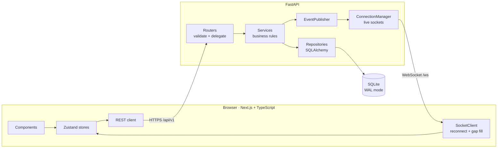
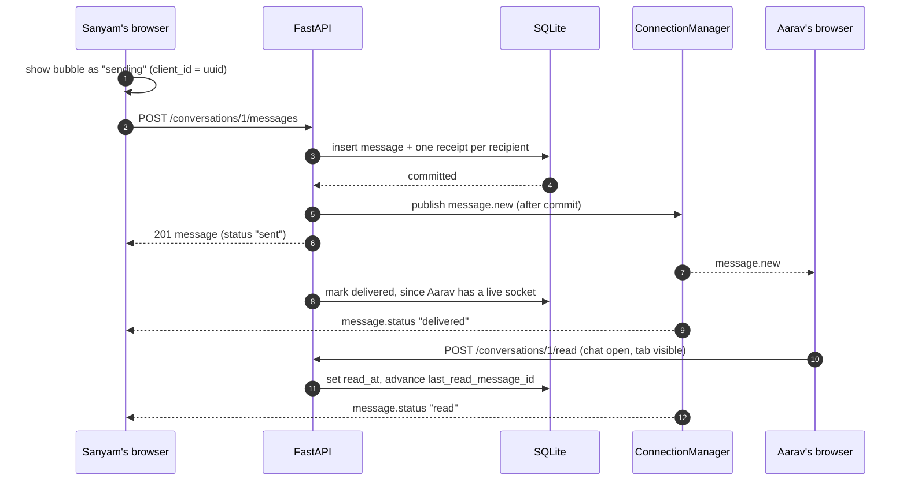
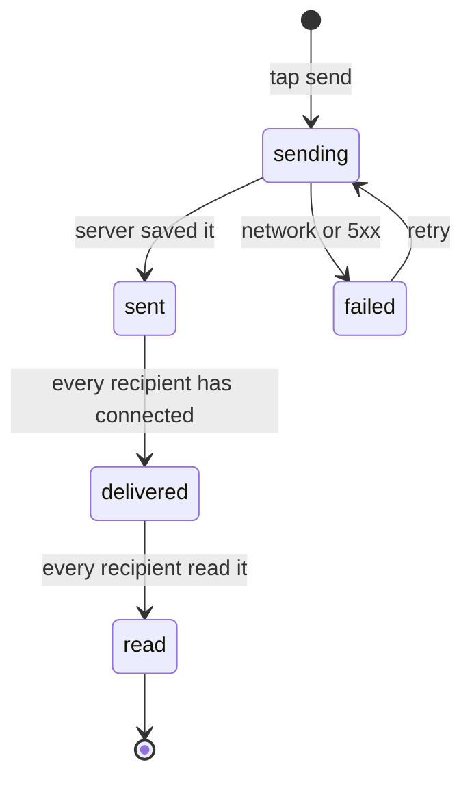
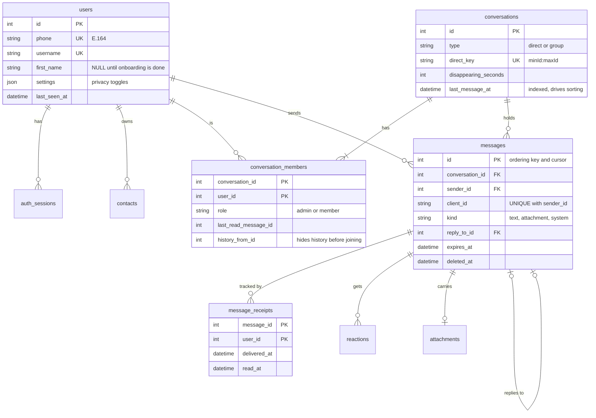

# Signal Clone

A working copy of the Signal Desktop experience, built for the Scaler AI Labs SDE Fullstack assignment.
You can sign in with a mocked OTP, chat one-to-one or in groups in real time, and see the same ticks,
typing dots, reactions and disappearing messages you'd expect from Signal. Encryption is simulated, as the
brief allows.


The same walkthrough as a smoother video: [docs/demo.mp4](docs/demo.mp4) (about 1.5 minutes: sign in, live
typing and receipts, a reaction, group info, search, dark and light themes, then the phone layout). A second
person is playing the other side of the chat live, so the typing dots, delivery and read ticks are real
WebSocket events, not a recording trick.

> This is an unofficial, educational project. It is not affiliated with Signal Messenger. The logo is my own
> drawing, and the only thing taken from Signal's design is its published color values.

|  |  |
|---|---|
| **Live app** | _add the Vercel URL here_ |
| **API** | _add the Render URL here_ (interactive docs at `/docs`) |
| **Demo login** | pick a demo account on the login screen, code **`123456`** |

The Render free tier sleeps when idle, so the first request can take up to a minute while it wakes up.

## Run it locally

You need Python 3.12+ with [uv](https://docs.astral.sh/uv/), and Node 22+ with [pnpm](https://pnpm.io/).

```bash
# terminal 1: API on http://localhost:8000
cd backend
uv sync
uv run uvicorn app.main:create_app --factory --reload

# terminal 2: web app on http://localhost:3000
cd frontend
pnpm install
pnpm dev
```

The database file is created and seeded on first start (`backend/data/signal.db`). Delete `backend/data`
to start over. To try real-time yourself, sign in as two people in two browser profiles, or use
`localhost` and `127.0.0.1`, which keep separate storage.

### Demo accounts

The OTP is always `123456`. Everyone is fictional and nothing is ever sent anywhere.

| Phone | Who | What to look at |
|---|---|---|
| +91 98765 00001 | Sanyam Wadhwa | The main account: unread badges, 6 groups, a disappearing-messages chat, Note to Self |
| +91 98765 00002 | Aarav Sharma | Gym buddy, admin of the trek group |
| +91 98765 00003 | Simran Kaur | Project partner, admin of the hackathon group |
| +91 98765 00004 | Harpreet Singh | Has the disappearing-messages chat with Sanyam |
| +91 98765 00005 to 00013 | Ishita, Kabir, Tanvi, Rohan, Neha, Anita, Dhruv, Arjun, Kriti | Also seeded |

The seed has 13 people, 12 direct chats and 6 groups with 316 messages, including replies, reactions,
photos, links and a mix of delivered and read states. Any other phone number just creates a new account.

### Settings you can change

| Variable | Where | Default | What it does |
|---|---|---|---|
| `NEXT_PUBLIC_API_URL` | frontend | `http://localhost:8000` | Where the API lives. The WebSocket URL is derived from it |
| `CORS_ORIGINS` | backend | `http://localhost:3000` | Comma-separated list of allowed origins |
| `JWT_SECRET` | backend | a dev value | Signs session tokens. The app refuses to start in production without a real one |
| `DATABASE_URL` | backend | local SQLite file | SQLAlchemy async URL |
| `SEED_ON_STARTUP` | backend | `true` | Seed demo data when the database is empty |

## What it does

- **Sign in and profile.** Phone number plus mocked OTP, display name, avatar upload, username, sessions
  that survive a refresh, logout that revokes the token.
- **Chat list.** Sorted by latest activity, unread badges, last-message preview, online dot and last seen,
  search across chats, contacts and message text, an unread filter, Note to Self, add contact.
- **One-to-one chat.** Messages arrive over WebSockets. Each one goes through sending, sent, delivered and
  read, with typing indicators, timestamps and day dividers. A failed send can be retried.
- **Groups.** Create with a name and members, see the member list, admins can add, remove, promote and
  demote, anyone can leave, and the group posts system messages ("Aarav added Kriti").
- **The Signal feel.** Nav rail and two-pane layout, bubble grouping and corner shapes, modals, toasts,
  settings for profile, appearance, chats, notifications and privacy.
- **Bonus items.** Attachments (images and files, with drag-and-drop and paste), emoji reactions, replies,
  disappearing messages that the server really deletes, dark mode, phone/tablet/desktop layouts, keyboard
  shortcuts, delete for everyone, in-chat search, and a chat color picker.
- **Placeholders.** Calls, Stories and Linked devices show a "coming soon" screen, and the safety-number
  screen is mocked.

## How it fits together



The one rule that shapes everything: **writes go through REST, pushes come over the WebSocket.** Sending a
message is an ordinary validated `POST`. The server saves it, commits, and only then tells the other
members' sockets about it. That keeps validation and persistence in one place, and the socket never has to
be trusted to carry data that matters. A client that misses an event (a dropped connection, a sleeping
laptop) just asks for messages after the last id it saw.

### What happens when someone sends a message



If the response and the socket echo both arrive, they merge into one bubble because they share the same
`client_id`. Retrying a failed send is safe for the same reason: `UNIQUE(sender_id, client_id)` means the
server stores it once.

### Message status



`sending` and `failed` only exist in the browser. Everything after that is worked out on the server from
the per-recipient receipts, and a status never moves backwards. If a recipient turns off read receipts,
their reads count as delivered.

### Backend layers

| Layer | What it does |
|---|---|
| `api/v1` | Thin routers. Parse the request, call one service, return a DTO |
| `services` | All the rules: membership, admin rights, receipts, disappearing timers |
| `repositories` | Queries only, one per aggregate |
| `models`, `schemas` | ORM tables, and the Pydantic shapes that go over the wire. ORM objects never leave a service |
| `realtime` | The `EventPublisher` protocol, the in-memory `ConnectionManager`, and the background purge task |
| `services/container.py` | Composition root. The only file that wires everything together |

Services depend on small protocols (`EventPublisher`, `PresenceTracker`) rather than on the WebSocket code.
The tests plug in a recording fake through the same seam, and swapping in Redis pub/sub later would not touch
any business rule.

### Frontend layout

| Path | What's in it |
|---|---|
| `src/app` | Routes: `/login`, `/onboarding/profile`, `/chats`, `/chats/[id]`, `/calls`, `/stories`, `/settings/[section]` |
| `src/components` | `chat`, `chat-list`, `modals`, `settings`, `layout`, and `ui` for the small reusable pieces |
| `src/stores` | One Zustand store per area: auth, conversations, messages, people, presence, ui |
| `src/lib` | The typed API client, the reconnecting socket client, and pure helpers (formatting, message merging, grouping) with unit tests |
| `src/hooks` | Typing broadcast, read marker, uploads, shortcuts |

## Database



| Table | Notes |
|---|---|
| `users` | Phone is unique and stored as E.164. `first_name IS NULL` means onboarding isn't finished |
| `auth_sessions` | One row per login, keyed by the token's `jti`. Logout sets `revoked_at`, so only that token dies |
| `contacts` | A directed address book: `UNIQUE(owner_id, contact_id)`, and a `CHECK` that you can't add yourself |
| `conversations` | `direct_key` makes sure a pair of people has exactly one chat, and that Note to Self is unique |
| `conversation_members` | Composite key. `history_from_id` is why someone added to a group later can't read older messages |
| `messages` | Ids only grow (`AUTOINCREMENT`), so they work as a sort key and a pagination cursor, and are never reused after a disappearing message is purged |
| `message_receipts` | A message's status is computed from these rows |
| `reactions` | One per user per message. A new emoji replaces the old one |
| `attachments` | Uploaded first with no message, linked when the message is sent. Orphans are swept after an hour |

Enums are `VARCHAR` with `CHECK` constraints, and foreign keys cascade so deleting a conversation cleans up
after itself. SQLite runs in WAL mode with foreign keys switched on.

## API

REST lives under `/api/v1` and expects `Authorization: Bearer <token>`. Every error has the same shape:
`{"error": {"code": "...", "message": "..."}}`. The full list with schemas is at `/docs`.

| Area | Endpoints |
|---|---|
| Auth | `POST /auth/request-otp` · `POST /auth/verify-otp` · `POST /auth/logout` · `GET /auth/me` |
| Users | `PATCH /users/me` · `GET /users/lookup?phone=` or `?username=` |
| Contacts | `GET /contacts` · `POST /contacts` · `PATCH /contacts/{id}` · `DELETE /contacts/{id}` |
| Conversations | `GET /conversations` · `POST /conversations/direct` · `GET` and `PATCH /conversations/{id}` · `POST /conversations/{id}/read` |
| Messages | `GET /conversations/{id}/messages?before_id=&after_id=&limit=` · `POST /conversations/{id}/messages` · `DELETE /messages/{id}` · `PUT` and `DELETE /messages/{id}/reaction` |
| Groups | `POST /groups` · `GET` and `POST /groups/{id}/members` · `PATCH` and `DELETE /groups/{id}/members/{userId}` · `POST /groups/{id}/leave` |
| Other | `POST /uploads` · `GET /search?q=` · `GET /health` |

**WebSocket `/ws`.** The first frame has to be `{"type": "auth", "token": "..."}`, which keeps tokens out of
URLs and server logs. After that the client sends `ping` and `typing`. The server sends `ready`,
`message.new`, `message.status`, `message.deleted`, `message.expired`, `reaction.updated`, `typing`,
`presence`, `user.updated` and `conversation.updated`, `.removed` or `.read`.

## Decisions worth explaining

- **Messages are ordered by id, not by timestamp.** Clocks on different devices disagree. The server assigns
  ids in arrival order, so ordering, pagination and "what did I miss" all use one integer.
- **Events are published after the commit.** A client can never hear about a message that was rolled back.
- **Presence waits five seconds before going offline.** Otherwise every page refresh would flash someone
  offline and back.
- **On reconnect the client catches up by id.** It re-fetches the chat list and asks each open chat for
  everything after its last known message, so a flaky connection loses nothing.
- **Read markers only move when you could actually see the message:** the chat is open, scrolled to the
  bottom, and the tab is visible.
- **The token lives in `localStorage`.** The frontend (Vercel) and API (Render) are on different domains,
  which makes third-party cookies unreliable. The cost is exposure to XSS, so message text is always
  rendered as text, never as HTML, and the API sends security headers.
- **Rate limits** (30 auth requests a minute per IP, 120 messages and 30 uploads a minute per user) are kept
  in memory, like the connection registry.

More on the reasoning, security notes and limits is in [docs/DESIGN.md](docs/DESIGN.md), and
[docs/REQUIREMENTS.md](docs/REQUIREMENTS.md) maps each line of the brief to the code that handles it.

## Assumptions and what is mocked

- The OTP is always `123456`. `request-otp` gives the same answer for every number, so it can't be used to
  find out who has an account.
- Encryption is simulated. Messages are stored as plain text, and the safety number is a stand-in, not
  derived from keys.
- Anyone registered can message anyone. There are no message requests and no blocking.
- A disappearing message's timer starts when it is sent. Real Signal starts it when the message is read.
- One attachment per message, up to 10 MB, from an allow-list of image and document types. Files are served
  from unguessable URLs without a login.
- Online and last-seen are shown because the brief asks for them. The real app doesn't show them.
- It runs as one server process because live connections are held in memory. Scaling out means replacing
  the `EventPublisher` with Redis pub/sub.
- On Render's free tier the SQLite file and uploads are recreated and reseeded on every deploy and restart,
  so anything you create there is temporary.

## Tests and checks

```bash
cd backend  && uv run pytest && uv run ruff check . && uv run ruff format --check .
cd frontend && pnpm lint && pnpm format:check && pnpm typecheck && pnpm test && pnpm build
```

- **Backend, 86 tests.** Auth and sessions, contacts, one chat per pair, idempotent sends, the receipt
  state machine, read markers, pagination, replies, delete rules, reactions, uploads, disappearing
  messages, group admin rules, hidden history for new members, and real WebSocket flows (auth, delivery,
  typing, presence).
- **Frontend, 61 tests.** Time formatting, message merging and ordering, timeline grouping, system-message
  text, link detection (including XSS strings), previews and emoji handling.
- **CI.** GitHub Actions runs lint, formatting, types, tests and a production build for both apps on every
  push.
- **By hand.** I clicked through the app in Chrome at 375px, 768px and desktop widths, in light and dark,
  with two sessions open to watch typing, receipts and presence update live. I have not tested it on a real
  iPhone, so Safari on iOS is unchecked.

## Keyboard shortcuts

| Keys | Action |
|---|---|
| `Alt` `N` | New chat (Signal uses `Ctrl+N`, but browsers keep that one for themselves) |
| `Ctrl` `K` | Search chats |
| `Alt` `↑` / `↓` | Previous / next chat |
| `Alt` `Shift` `↓` | Next unread chat |
| `Enter` / `Shift` `Enter` | Send / new line |
| `Esc` | Close dialog, cancel reply, or leave the chat |
| `Ctrl` `/` | Show this list in the app |

## Deploying

**API on Render.** Push the repo, choose *New → Blueprint* and pick it. `render.yaml` sets the build and
start commands and generates `JWT_SECRET`. Then set `CORS_ORIGINS` to your Vercel URL.

**Web app on Vercel.** Import the repo, set the Root Directory to `frontend`, and add
`NEXT_PUBLIC_API_URL` with your Render URL (no trailing slash).

## Repository layout

```
backend/     FastAPI app (app/), tests (tests/), pyproject.toml, uv.lock
frontend/    Next.js app (src/), vitest config
docs/        REQUIREMENTS.md, DESIGN.md, demo.gif, demo.mp4
render.yaml  Render blueprint for the API
.github/     CI workflow
```

## Author

Built by **Sanyam Wadhwa** ([@SanyamWadhwa07](https://github.com/SanyamWadhwa07)).
