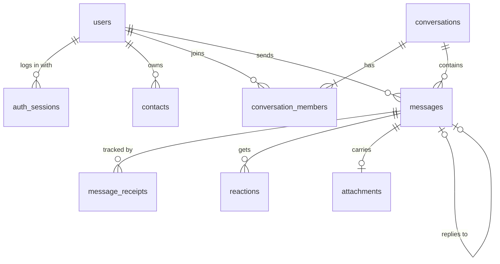

# Signal Clone

A full-stack recreation of the Signal Desktop messaging experience: real-time one-to-one and group chat,
delivery and read receipts, typing indicators, reactions, replies, attachments and disappearing messages,
with Signal's layout, colors and interaction patterns. Encryption is simulated, as the brief allows.

> **Unofficial.** This is an educational project built for a coding assignment. It is not affiliated with
> or endorsed by Signal Messenger. It uses its own logo drawing and only Signal's published color values
> as design reference.

|  |  |
|---|---|
| **Live demo** | _add your Vercel URL here_ |
| **API** | _add your Render URL here_ (`/docs` for interactive API docs) |
| **Demo login** | any seeded number below, verification code **`123456`** |

## Features

| Area | What works |
|---|---|
| **Onboarding** | Phone sign-in with a mocked OTP, display name and avatar upload, username, persistent sessions, logout |
| **Chats list** | Sorted by latest activity, unread badges, last-message preview, online dot and "last seen", search (chats, contacts, message text), unread filter, Note to Self |
| **1:1 messaging** | Real-time over WebSockets, timestamps, **sending → sent → delivered → read** ticks, typing indicators, optimistic send with retry, everything persisted |
| **Groups** | Create with name and members, group messaging, member list, admin controls (add, remove, promote, demote), leave (an admin is auto-promoted when the last one leaves), edit name and description, system messages |
| **Signal experience** | Nav rail, two-pane layout, bubble grouping and corner shapes, inline timestamps, day dividers, "N unread messages" divider, modals, toasts, settings (profile, appearance, chats, notifications, privacy) |
| **Hardening** | Per-user/IP rate limiting, security headers, input validation on both sides, fail-fast production config, JSON error contract. See [docs/DESIGN.md](docs/DESIGN.md) |
| **Bonus** | Attachments (images and files, drag-drop and paste), emoji reactions, reply-to quotes, disappearing messages (8 presets, server-enforced), dark mode, responsive phone/tablet/desktop layout, keyboard shortcuts, delete for everyone, in-chat search, chat color picker |
| **Placeholders** | Voice/video calls, Stories, Linked devices, real end-to-end encryption (a mock safety-number screen is included) |

## Quick start

Requirements: **Python 3.12+** with [uv](https://docs.astral.sh/uv/), **Node 22+** with [pnpm](https://pnpm.io/).

```bash
# 1. Backend  (http://localhost:8000, API docs at /docs)
cd backend
uv sync
uv run uvicorn app.main:create_app --factory --reload

# 2. Frontend (http://localhost:3000), in a second terminal
cd frontend
pnpm install
pnpm dev
```

The database is created and seeded automatically on first start (`backend/data/signal.db`).
Delete `backend/data` to reset it.

### Demo accounts

The verification code is always **`123456`**. All people and numbers are fictional; nothing is ever sent to them.

| Phone | User | Notes |
|---|---|---|
| +91 98765 00001 | Sanyam Wadhwa | Main demo account: 7 chats with unread badges (21 messages), 6 groups, a disappearing chat, Note to Self, "Mummy" and "Didi" nicknames |
| +91 98765 00002 | Aarav Sharma | Gym buddy; admin of the trek group |
| +91 98765 00003 | Simran Kaur | Project partner; admin of the hackathon group |
| +91 98765 00004 | Harpreet Singh | Code reviewer; disappearing-messages chat with Sanyam |
| +91 98765 00005 – 13 | Ishita, Kabir, Tanvi, Rohan, Neha, Anita, Dhruv, Arjun, Kriti | Also seeded (log in with any of them) |

The seed creates **13 people, 12 direct chats and 6 groups with 316 messages**: replies, reactions, photos,
link messages, mixed delivered/read states, unread badges, and an illustrated profile picture for almost
everyone. Any other number you enter is a brand-new account.

**Try real-time:** sign in as Sanyam in one browser profile and as Bob in another (or use `localhost` and
`127.0.0.1`, which have separate storage), then message each other.

### Configuration

| Variable | Where | Default | Purpose |
|---|---|---|---|
| `NEXT_PUBLIC_API_URL` | frontend | `http://localhost:8000` | Backend base URL (the WebSocket URL is derived from it) |
| `CORS_ORIGINS` | backend | `http://localhost:3000` | Comma-separated allowed origins |
| `JWT_SECRET` | backend | dev value | Signs session tokens. **Set this in production** |
| `DATABASE_URL` | backend | local SQLite file | SQLAlchemy async URL |
| `SEED_ON_STARTUP` | backend | `true` | Seed demo data when the database is empty |

## Tech stack

- **Frontend:** Next.js 16 (App Router) · TypeScript (strict) · Tailwind CSS v4 · Zustand · Vitest
- **Backend:** Python 3.12 · FastAPI · SQLAlchemy 2.0 (async) · aiosqlite · Pydantic v2 · PyJWT · pytest
- **Database:** SQLite (WAL mode, foreign keys enforced)
- **Real-time:** native WebSockets (FastAPI/Starlette)
- **Tooling:** ruff · ESLint · GitHub Actions CI

## Architecture

```
┌────────────── Browser (Next.js) ──────────────┐        ┌──────────────── FastAPI ────────────────┐
│  Zustand stores ◄─ realtime handlers ◄─ WS ───┼────────┼─► ConnectionManager (EventPublisher)     │
│   auth · conversations · messages ·           │  REST  │      ▲                                   │
│   people · presence · ui                      ├────────┼─► routers (thin) ─► services ─► repos ─► SQLite
│  components (chat · chat-list · modals · ui)  │        │      business rules   data access        │
└───────────────────────────────────────────────┘        └──────────────────────────────────────────┘
```

**Writes go through REST, pushes come over the WebSocket.** Sending a message is a validated, testable
`POST`; the server persists it, commits, then fans the event out to every member's live sockets. This
keeps validation, idempotency and persistence in one place and makes the real-time layer a pure
notification channel.

### Backend layers (`backend/app`)

| Layer | Responsibility |
|---|---|
| `api/v1/*` | Thin routers: parse request, call one service, return a DTO. No business rules |
| `services/*` | All business rules (membership, admin rights, receipts, disappearing timers). Depend on repositories and the `EventPublisher` *protocol* |
| `repositories/*` | Data access only (SQLAlchemy queries). One per aggregate |
| `models/*` | ORM tables |
| `schemas/*` | Pydantic request/response DTOs. ORM objects never leave the service layer |
| `realtime/*` | `EventPublisher` protocol, in-memory `ConnectionManager`, background tasks |
| `services/container.py` | Composition root: the only place that wires repositories, services and infrastructure |

SOLID in practice: single-responsibility layers; services depend on abstractions (`EventPublisher`,
`PresenceTracker`) so a Redis-backed publisher could replace the in-memory one without touching business
code; the tests inject a recording `FakeRealtime` through the same seam.

Events are published **after** the database commit, so a client never hears about something that was
rolled back.

### Frontend structure (`frontend/src`)

| Path | Contents |
|---|---|
| `app/` | Routes: `/login`, `/onboarding/profile`, `/chats`, `/chats/[id]`, `/calls`, `/stories`, `/settings/[section]` |
| `components/chat`, `chat-list`, `modals`, `settings`, `layout`, `ui` | UI by feature; `ui/` holds reusable primitives (avatar, modal, menu, toggle, …) |
| `stores/` | One Zustand store per domain (auth, conversations, messages, people, presence, ui) |
| `lib/api` | Typed REST client; `lib/realtime` — reconnecting `SocketClient` and the event → store dispatcher |
| `lib/*.ts` | Pure, unit-tested logic: formatting, message merging/ordering, timeline grouping, link detection, system-message text |
| `hooks/` | Reusable behavior: typing broadcast, read marker, attachment upload, shortcuts |

### How the real-time pieces work

- **Optimistic send.** The bubble appears instantly as `sending` with a client-generated id. The server
  de-duplicates by `(sender_id, client_id)`, so retries are idempotent, and the HTTP response and the
  WebSocket echo merge into one bubble.
- **Status** is computed server-side from per-recipient receipts: `sent` → `delivered` (every recipient
  has a live connection or has since connected) → `read` (every recipient read it, and has read receipts
  enabled). Statuses only ever move forward.
- **Unread & read marker.** Each member has a `last_read_message_id`; the client advances it only while
  the chat is open, scrolled to the bottom, and the tab is visible.
- **Presence.** Online while at least one socket is open; a 5 s grace period after the last socket closes
  avoids flicker on refresh, then `last_seen_at` is stored and broadcast.
- **Reconnect.** Exponential backoff with jitter; on reconnect the client re-fetches the chat list and
  gap-fills every open conversation by message id.
- **Disappearing messages.** `expires_at` is set from the conversation timer at send time. The API hides
  expired messages immediately, a background task hard-deletes them every few seconds and notifies members.

## Database schema



| Table | Purpose and key constraints |
|---|---|
| `users` | `phone` unique (E.164), optional unique `username`, profile fields, `settings` JSON (privacy toggles), `last_seen_at`. `first_name IS NULL` means onboarding isn't finished |
| `auth_sessions` | One row per login (`jti` unique). Logout sets `revoked_at`, which invalidates that token only |
| `contacts` | Directed address book: `UNIQUE(owner_id, contact_id)`, `CHECK(owner_id <> contact_id)`, optional nickname |
| `conversations` | `type` direct/group, group name/description/avatar, `disappearing_seconds`, `last_message_at` (indexed, drives sorting). `direct_key` (`"minId:maxId"`, unique) guarantees one DM per pair and one Note to Self |
| `conversation_members` | Composite PK `(conversation_id, user_id)`, `role` admin/member, `last_read_message_id`, `history_from_id` (new members never see earlier history) |
| `messages` | Monotonic `id` is the ordering key and pagination cursor. `kind` text/attachment/system, `meta` JSON for system events, `reply_to_id` self-FK, `expires_at`, soft-delete `deleted_at`. `UNIQUE(sender_id, client_id)` makes sends idempotent. `INDEX(conversation_id, id)` |
| `message_receipts` | PK `(message_id, user_id)`, `delivered_at`, `read_at`. A message's status is the aggregate over its receipts |
| `reactions` | PK `(message_id, user_id)`: one reaction per user per message, replacing the previous one |
| `attachments` | Uploaded first (`message_id` NULL), then linked on send. Unattached uploads are swept after an hour |

Design notes: enums are stored as `VARCHAR` with `CHECK` constraints; cascading deletes keep the graph
consistent; message ids are `AUTOINCREMENT`, so ids are never reused after disappearing messages are purged.

## API overview

REST lives under `/api/v1` and takes `Authorization: Bearer <token>`. Errors are always
`{"error": {"code": "...", "message": "..."}}`. Interactive docs: `/docs`.

| Area | Endpoints |
|---|---|
| Auth | `POST /auth/request-otp` · `POST /auth/verify-otp` · `POST /auth/logout` · `GET /auth/me` |
| Users | `PATCH /users/me` · `GET /users/lookup?phone=\|username=` |
| Contacts | `GET /contacts` · `POST /contacts` · `PATCH /contacts/{id}` · `DELETE /contacts/{id}` |
| Conversations | `GET /conversations` · `POST /conversations/direct` · `GET\|PATCH /conversations/{id}` · `POST /conversations/{id}/read` |
| Messages | `GET /conversations/{id}/messages?before_id=&after_id=&limit=` · `POST /conversations/{id}/messages` · `DELETE /messages/{id}` · `PUT\|DELETE /messages/{id}/reaction` |
| Groups | `POST /groups` · `GET\|POST /groups/{id}/members` · `PATCH\|DELETE /groups/{id}/members/{userId}` · `POST /groups/{id}/leave` |
| Other | `POST /uploads` · `GET /search?q=` · `GET /health` |

**WebSocket** `/ws`: the first frame must be `{"type":"auth","token":"…"}` (keeps tokens out of URLs and logs).
Server events: `ready`, `message.new`, `message.status`, `message.deleted`, `message.expired`,
`reaction.updated`, `typing`, `presence`, `user.updated`, `conversation.updated|removed|read`.
Client frames: `auth`, `ping`, `typing`.

## Assumptions and mocked parts

- **Verification is mocked.** The OTP is always `123456`; no SMS is sent. `request-otp` returns the same
  response for every number, so it can't be used to enumerate accounts.
- **Encryption is simulated.** Messages are stored in plaintext in the demo database. The "safety number"
  is a deterministic stand-in, not derived from keys.
- **Anyone can message anyone** who is registered (no message requests, no blocking).
- **Disappearing messages** start their timer when sent (Signal starts it when read).
- **One attachment per message**, max 10 MB, from an allow-list of image and document types. Uploaded
  files are served from unguessable URLs without authentication.
- **Single server process.** Live connections are kept in memory; scaling out means swapping the
  `EventPublisher` for Redis pub/sub.
- **Ephemeral demo data on Render's free tier.** The SQLite file and uploads are re-created and re-seeded
  on each deploy/restart. The first request after idle can take about a minute while the service wakes.
- Online / last-seen indicators are shown because the brief asks for them (the real app hides them).
- **Rate limits** (30 auth requests/min per IP, 120 messages/min and 30 uploads/min per user) are in memory per process, like the connection registry.

## Testing and quality

```bash
cd backend  && uv run pytest && uv run ruff check . && uv run ruff format --check .
cd frontend && pnpm lint && pnpm format:check && pnpm typecheck && pnpm test && pnpm build
```

- **Backend:** 86 tests covering auth and sessions, contacts, DM uniqueness, sending/idempotency, the
  receipt state machine, read markers, pagination, replies, deletion rules, reactions, uploads,
  disappearing messages, group admin rules, history hiding, and real WebSocket flows (auth, delivery,
  typing, presence).
- **Frontend:** unit tests for time formatting, message merging/ordering, timeline grouping, system
  messages, link detection (including XSS cases), previews and emoji handling.
- **CI:** GitHub Actions runs lint, types, tests and a production build for both apps on every push.

## Keyboard shortcuts

`Alt+N` new chat · `Ctrl+K` search · `Alt+↑/↓` previous/next chat · `Alt+Shift+↓` next unread ·
`Enter` send · `Shift+Enter` new line · `Esc` close dialog / cancel reply / leave chat · `Ctrl+/` shortcut list.
(Signal Desktop uses `Ctrl+N`; browsers reserve it, so it is `Alt+N` here.)

## Deployment

**Backend → Render** (free web service). Push the repo, then *New → Blueprint* and select it. `render.yaml`
configures the build/start commands and generates `JWT_SECRET`. Set `CORS_ORIGINS` to your Vercel URL.

**Frontend → Vercel.** Import the repo, set the **Root Directory** to `frontend`, and add the environment
variable `NEXT_PUBLIC_API_URL` = your Render URL (no trailing slash). The WebSocket URL is derived from it.

## Project layout

```
backend/    FastAPI app (app/), tests (tests/), pyproject.toml, uv.lock
frontend/   Next.js app (src/), vitest config
docs/       REQUIREMENTS.md (brief → code map), DESIGN.md (principles and trade-offs)
render.yaml Render blueprint for the API
.github/    CI workflow
```

## Author

Built by **Sanyam Wadhwa** ([@SanyamWadhwa07](https://github.com/SanyamWadhwa07)) for the Scaler AI Labs SDE Fullstack assignment.
